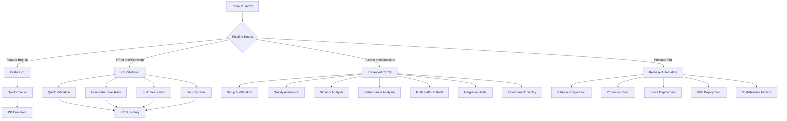

# StudyBuddy CI/CD Architecture

## 🏗️ Overview

The StudyBuddy CI/CD pipeline is designed as a comprehensive, automated system that ensures code quality, security, and reliable deployments across multiple environments and platforms.

## 🔄 Pipeline Architecture

## 📋 Pipeline Components

### 1. Enhanced CI/CD Pipeline (`enhanced-ci-cd.yml`)

**Triggers:**
- Push to `main`, `develop`, `qa_infrastructure_*`
- Pull requests to `main`, `develop`
- Release events
- Manual workflow dispatch

**Key Features:**
- Environment-specific deployments
- Multi-platform builds (Android, iOS, Web)
- Advanced security scanning
- Performance monitoring
- Integration testing

**Jobs:**
1. **Setup & Validation** - Determines build requirements and environment
2. **Quality Assurance** - Parallel linting, testing, auditing, type checking
3. **Security Analysis** - CodeQL, Snyk, OWASP dependency check
4. **Performance Analysis** - Bundle analysis and performance metrics
5. **Multi-Platform Build** - Android, iOS, and Web builds
6. **Integration Tests** - End-to-end testing
7. **Environment Deploy** - Environment-specific deployments
8. **Post-Deploy Monitoring** - Health checks and notifications

### 2. PR Validation Pipeline (`pr-validation.yml`)

**Triggers:**
- Pull request events (opened, synchronized, reopened)
- Pull request reviews

**Key Features:**
- Complexity-based testing strategy
- Automated reviewer assignment
- Visual regression testing
- Comprehensive PR feedback

**Jobs:**
1. **PR Info** - Analyzes changes and calculates complexity
2. **Quick Checks** - Fast feedback loop
3. **Comprehensive Tests** - Full test suite for complex PRs
4. **Build Verification** - Build validation for significant changes
5. **Security Scan** - Differential security analysis
6. **Visual Tests** - Visual regression detection
7. **PR Summary** - Automated feedback and metrics

### 3. Release Automation Pipeline (`release-automation.yml`)

**Triggers:**
- Git tags (`v*.*.*`)
- Release events
- Manual workflow dispatch

**Key Features:**
- Automated version bumping
- Multi-platform production builds
- App store deployments
- Release notes generation

**Jobs:**
1. **Prepare Release** - Version management and changelog
2. **Release QA** - Final quality assurance
3. **Production Build** - Production-ready builds
4. **Create GitHub Release** - Automated release creation
5. **Deploy Stores** - App store deployments
6. **Deploy Web** - Web application deployment
7. **Post-Release Monitoring** - Deployment monitoring

### 4. Performance Monitoring (`performance-monitoring.yml`)

**Triggers:**
- Scheduled (every 6 hours)
- Push to main branch
- Manual trigger

**Key Features:**
- Lighthouse audits
- Bundle size tracking
- Security dependency audits
- Performance regression detection

## 🔧 Configuration Files

### CI Configuration (`config/ci/`)

- **`audit-ci.config.json`** - Security audit settings
- **`eas.json`** - Expo Application Services configuration
- **`sonarqube.properties`** - Code quality analysis
- **`lighthouse.config.js`** - Performance monitoring

### GitHub Configuration

- **`.github/CODEOWNERS`** - Code review assignments
- **`.github/ISSUE_TEMPLATE/ci-cd-issue.yml`** - Issue template

## 🚀 Deployment Strategies

### Environment Matrix

| Environment | Branch | Build Type | Deployment Target |
|-------------|--------|------------|-------------------|
| Development | Feature branches | Expo | Internal testing |
| Staging | `develop` | Expo | Internal testing |
| Production | `main` | EAS | App stores + Web |

### Platform Support

- **Android**: APK (development) → AAB (production) → Google Play Store
- **iOS**: Development builds → Production IPA → App Store Connect
- **Web**: Static build → GitHub Pages

## 🔐 Security Implementation

### Security Scanning Layers

1. **Dependency Scanning** - npm audit, Snyk
2. **Code Analysis** - CodeQL, SonarQube
3. **Container Security** - OWASP dependency check
4. **Secrets Detection** - Built-in GitHub secret scanning

### Security Gates

- **Critical vulnerabilities** - Block deployment
- **High vulnerabilities** - Require approval
- **Medium vulnerabilities** - Warning notifications

## 📊 Quality Gates

### Code Quality Metrics

- **Test Coverage**: >80% for production deployments
- **Linting**: Zero errors, warnings allowed
- **Performance**: Bundle size <1MB, Lighthouse score >80
- **Security**: No critical/high vulnerabilities

### Build Criteria

- All tests pass
- Security scans pass
- Performance within thresholds
- Code review approval (for PRs)

## 🔄 Workflow Optimization

### Performance Features

- **Parallel Execution** - Jobs run concurrently where possible
- **Conditional Execution** - Smart triggering based on file changes
- **Caching Strategy** - npm cache, build artifacts
- **Artifact Management** - Efficient storage and retrieval

### Development Experience

- **Fast Feedback** - Quick checks provide immediate feedback
- **Smart Testing** - Test suite scales with PR complexity
- **Auto-assignment** - Reviewers assigned based on complexity
- **Rich Feedback** - Detailed PR comments with metrics

## 📈 Monitoring & Observability

### Metrics Collection

- Build success rates
- Deployment frequency
- Lead time for changes
- Recovery time from failures

### Alerts & Notifications

- Build failures
- Security vulnerabilities
- Performance regressions
- Deployment status

## 🛠️ Maintenance

### Regular Tasks

- **Dependency Updates** - Automated via Dependabot
- **Action Updates** - Quarterly review and updates
- **Secret Rotation** - As per security policy
- **Performance Tuning** - Monthly analysis

### Troubleshooting

Common issues and solutions:

1. **Build Failures** - Check logs, verify dependencies
2. **Test Failures** - Review test output, check environment
3. **Deployment Issues** - Verify secrets, check target status
4. **Performance Issues** - Analyze bundle, check resource usage

## 🔮 Future Enhancements

### Planned Improvements

- **Progressive Deployment** - Canary and blue-green deployments
- **Advanced Monitoring** - APM integration
- **ML-Based Testing** - Intelligent test selection
- **Multi-Region Deployment** - Global CDN deployment

## 📚 Resources

- [GitHub Actions Documentation](https://docs.github.com/en/actions)
- [Expo Application Services](https://docs.expo.dev/eas/)
- [React Native Testing](https://reactnative.dev/docs/testing-overview)
- [Security Best Practices](https://docs.github.com/en/code-security)

---

*This architecture documentation is maintained as part of the StudyBuddy CI/CD system and is updated with each major pipeline revision.*